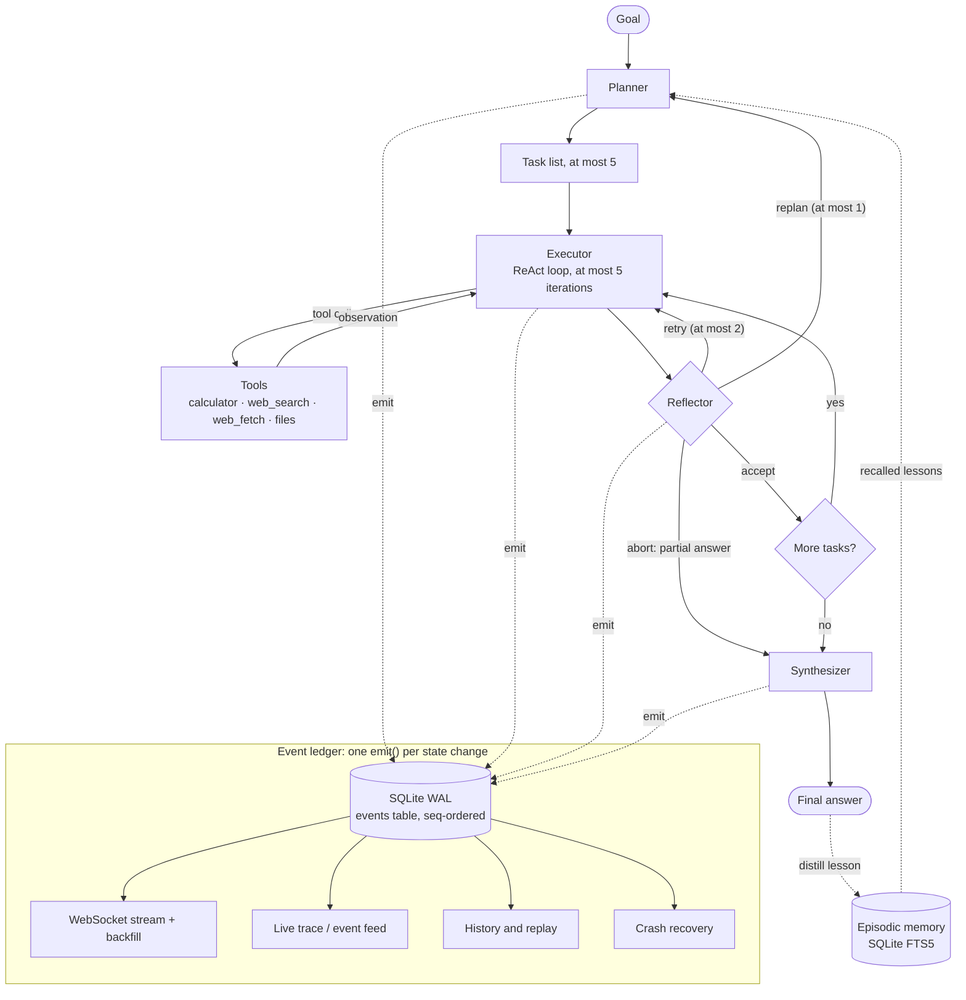

# ATLAS

[](https://github.com/adityasinha-4real/atlas-the-agent/actions/workflows/ci.yml)


**A hand-built agentic AI runtime (plan, act, reflect, recover) running on a local LLM.**

You give ATLAS a goal in natural language. It then:

- **plans** an ordered task list;
- executes each task with a hand-built **ReAct loop** that calls tools;
- **judges its own output** with a reflector that can `retry` a weak attempt,
  `replan` a wrong approach, or gracefully `abort` with a partial answer, all
  within per-run **budgets**;
- **synthesizes** a final answer.

It runs on a local model (Ollama `qwen2.5:7b-instruct`) with no cloud
dependency, and it uses no agent framework: the loop, reflection and memory are
all written by hand.

The architecture is worth a look for two reasons:

- **Every state change is one ordered, persisted event.** A single `emit()`
  writes each event to a SQLite ledger. That ledger feeds the live WebSocket
  stream, reconnect backfill, the History/Replay page and crash recovery. Live
  view and replay use the same reducer, so the two can't disagree.
- **Every layer assumes the model is erratic.** Small local models misbehave,
  so each layer recovers: tolerant JSON parsing with a repair loop, tool
  errors turned into observations, reflection with an acceptance bias, and hard
  budgets so a run always terminates.

> **Demo:**
> <!-- DEMO GIF PLACEHOLDER: record goal → plan checklist → tasks executing →
>      visible retry/reflection → final answer, save it as docs/assets/demo.gif,
>      then replace this block with:  -->
> 🎬 *Demo GIF not recorded yet.* It needs a real model (Ollama) to show a
> visible retry/replan. See [Quick start → C](#c--full-stack-with-a-real-model-docker--ollama).

---

## Features

| Area | What it does |
|---|---|
| **Planning** | A goal becomes an ordered list of at most 5 tasks. The output is parsed tolerantly, repaired and normalized ([ADR-0002](docs/adr/0002-list-over-dag.md)). |
| **Bounded ReAct execution** | Think → act → observe, at most 5 iterations per task. The model replies with a JSON action envelope; bad JSON triggers a repair loop and then graceful degradation ([ADR-0008](docs/adr/0008-envelope-and-graceful-degradation.md)). |
| **Tool use** | `calculator` (safe AST eval, never `eval`), `web_search`, `web_fetch`, and `file_read`/`file_write` restricted to one workspace folder. Every tool failure becomes an observation, never an exception. |
| **Reflection** | The reflector grades each attempt as `accept` / `retry` / `replan` / `abort`, with a deterministic pre-check and a bias toward accepting ([ADR-0011](docs/adr/0011-reflector-acceptance-bias.md)). |
| **Retry / replan / graceful abort** | At most 2 retries per task, each with the reflector's critique. At most 1 replan per run, covering only the remaining work. An abort returns a partial answer built from the completed tasks ([ADR-0013](docs/adr/0013-replan-from-current-state.md), [ADR-0014](docs/adr/0014-graceful-abort-partial-answer.md)). |
| **Budgets** | Hard per-run caps on model calls and tool calls, so every run terminates ([ADR-0012](docs/adr/0012-central-budget-enforcement.md)). |
| **Event ledger** | Every state change is a `seq`-ordered row in SQLite. The same ledger serves trace, streaming, backfill and replay ([ADR-0005](docs/adr/0005-emit-over-event-bus.md)). |
| **WebSocket streaming** | Subscribes before backfilling, so a reconnect has no gaps or duplicates. The plan checklist is built entirely from events ([ADR-0009](docs/adr/0009-event-sourced-plan-checklist.md)). |
| **History & replay** | A list of past runs, plus a scrubber-style replay that feeds the ledger through the same reducer the live page uses. |
| **Episodic memory** | Finished runs are distilled into lessons stored in **SQLite FTS5** and recalled at plan time. Browse, search, pin or delete them on the Memory page ([ADR-0004](docs/adr/0004-fts5-over-faiss.md), [ADR-0018](docs/adr/0018-recall-at-plan-time.md)). |
| **Observability** | `GET /metrics` (Prometheus text, opt-in), a `GET /ready` dependency check (DB, FTS5, provider) and optional JSON logs ([ADR-0022](docs/adr/0022-passive-dependency-free-observability.md)). |
| **Crash recovery** | At startup, runs interrupted by a crash are closed out in a consistent final state rebuilt from the ledger ([ADR-0021](docs/adr/0021-crash-recovery-reconcile-not-resume.md)). |
| **Evaluation** | A deterministic benchmark suite with a CI threshold check, and 8 golden evals that produce a [scorecard](evals/scorecard.md). |
| **Generated OpenAPI client** | The frontend's REST types are generated from the backend's OpenAPI schema. CI regenerates both and fails on any diff. |

Reflection (`ATLAS_AGENT_ENABLE_REFLECTION`) and memory (`ATLAS_MEMORY_ENABLED`)
are **opt-in and off by default**. With both off, runs behave exactly like the
single-pass planner, and every hardening feature is off, passive or a no-op by
default (invariants I-13, I-15, I-23 in
[`docs/ARCHITECTURE.md`](docs/ARCHITECTURE.md)).

## Architecture



The system has two processes. A **FastAPI backend** runs the `RunManager`
(orchestration), the agent components, the tool registry and an `LLMGateway`
that talks to either Ollama or the deterministic `echo` provider. Persistence is
async SQLAlchemy over SQLite in WAL mode. A **Next.js frontend** provides the Run,
History/Replay and Memory pages. Full detail is in
[`docs/ARCHITECTURE.md`](docs/ARCHITECTURE.md), and every design decision is
recorded as an [ADR](docs/adr/). The complete specification is
[`ATLAS-Design-Review-V2.md`](ATLAS-Design-Review-V2.md).

## Tech stack

| Layer | Technology |
|---|---|
| Backend | Python 3.11+ (dev on 3.14, Docker on 3.12) · FastAPI · Pydantic / pydantic-settings · async SQLAlchemy |
| Persistence | SQLite in WAL mode · FTS5 full-text index for memory |
| Model | Local LLM via **Ollama** (`qwen2.5:7b-instruct`) · `echo` provider for model-free dev/CI |
| Streaming | WebSocket (seq-numbered, replayable) |
| Frontend | Next.js 14 (App Router) · TypeScript · Tailwind CSS · `openapi-typescript` + `openapi-fetch` |
| Packaging | Docker · Docker Compose |
| CI | GitHub Actions: Windows + Linux backend matrix, frontend job; no Ollama needed |

## Evaluation

`python -m evals` runs 8 golden scenarios through the **real runtime** on a
**scripted model**. The current [scorecard](evals/scorecard.md) is **8/8**:

| Eval | Checks |
|---|---|
| `single_task`, `multi_task` | plan → execute → synthesize |
| `tool_use` | a tool call and its observation |
| `retry_then_accept` | reflector `retry` → accepted attempt |
| `replan` | reflector `replan` → new plan generation |
| `partial_abort` | graceful abort → run `failed` with a partial answer |
| `retry_exhaustion_fails` | retries run out → run fails cleanly |
| `memory_lift` | a lesson from run A is recalled in run B |

**What this does and does not show:** the scorecard proves the agent's *control
flow* (retry, replan, abort, memory, budgets) behaves correctly and
deterministically. It does **not** measure answer quality on a real model,
because model responses are scripted. The benchmark suite
([`bench/`](bench/README.md)) separately tracks latency against committed
baselines, and CI fails on regressions beyond threshold.

## Testing

**312 backend tests pass with 92% line coverage** (CI enforces a floor of 85%).
No test needs Ollama or network access: agent logic runs against the `echo`
provider and a scripted **FakeLLM**.

```bash
cd backend
.venv/Scripts/python.exe -m pytest --cov=atlas --cov-fail-under=85   # tests + coverage
.venv/Scripts/python.exe -m ruff check atlas tests                   # lint
cd ../frontend && npm run typecheck && npm run build                 # frontend gates
cd .. && backend/.venv/Scripts/python.exe -m bench --ci               # benchmark guard
backend/.venv/Scripts/python.exe -m evals                             # golden evals → scorecard
```

CI ([`.github/workflows/ci.yml`](.github/workflows/ci.yml)) runs all of the
above, plus OpenAPI/client drift checks, on every push. It never needs Ollama.
The test suite also checks consistency: versions match across files, and every
`ATLAS_*` setting is documented in `.env.example`.

## Quick start

There are three ways to run it. **A** is the quickest check on a clean machine
and needs only Docker. **C** is the full experience and needs Ollama.

### A — Docker, no model (echo provider)

```bash
docker compose -f docker-compose.yml -f docker-compose.echo.yml up --build backend frontend
```

Open **http://localhost:3000**, type a goal and press **Run**. The run streams
through planning, execution and answer. In echo mode the plan is a single task
(the goal itself), and the answer echoes it back. That proves the whole stack is
wired correctly, but not that the agent is smart.

Check the backend with `curl http://localhost:8000/health` and
`curl http://localhost:8000/ready`. API docs are at http://localhost:8000/docs.

### B — Local development

Prerequisites: Python 3.11+ and Node 20+. The commands below are for Windows;
on macOS/Linux use `.venv/bin/python` and `cp`.

```bash
# Terminal 1: backend
cd backend
py -m venv .venv
.venv/Scripts/python.exe -m pip install --only-binary=:all: -r requirements-dev.txt
copy .env.example .env            # then set ATLAS_LLM_PROVIDER=echo if you have no Ollama
.venv/Scripts/python.exe -m uvicorn atlas.main:app --host 127.0.0.1 --port 8000

# Terminal 2: frontend
cd frontend
npm install
copy .env.local.example .env.local   # NEXT_PUBLIC_API_BASE must match the backend URL
npm run dev                          # → http://localhost:3000
```

If port 8000 is taken, run uvicorn on another port and update
`NEXT_PUBLIC_API_BASE` in `frontend/.env.local` to match. The
[`Makefile`](Makefile) wraps the same steps: `make setup`, `make run-backend`
(echo provider), `make run-frontend`, `make test`, `make lint`.

To regenerate the typed API client after changing a route or response model,
run `make gen-api`. It works offline and doesn't need the backend running.

### C — Full stack with a real model (Docker + Ollama)

```bash
docker compose up -d ollama
docker compose exec ollama ollama pull qwen2.5:7b-instruct   # one-time, about 4.7 GB
docker compose up --build
```

The frontend is at http://localhost:3000 and the backend at
http://localhost:8000. This is the mode that shows multi-task plans, tool calls
and, with `ATLAS_AGENT_ENABLE_REFLECTION=true` on the backend service, visible
retry/replan. Try: *"Compare the populations of France and Germany."*

## Configuration

Everything is set through environment variables with the `ATLAS_` prefix.
Nothing is hardcoded. Copy [`backend/.env.example`](backend/.env.example), which
documents every setting, to `.env`. List settings accept comma-separated values
(`ATLAS_CORS_ORIGINS=http://a,http://b`).

| Variable | Default | Purpose |
|---|---|---|
| `ATLAS_LLM_PROVIDER` | `ollama` | `ollama`, or `echo` for dev/CI |
| `ATLAS_LLM_MODEL` | `qwen2.5:7b-instruct` | Ollama model tag |
| `ATLAS_LLM_BASE_URL` | `http://localhost:11434` | Ollama endpoint |
| `ATLAS_DATABASE_URL` | `sqlite+aiosqlite:///./data/atlas.db` | Async SQLite URL |
| `ATLAS_CORS_ORIGINS` | `http://localhost:3000` | Allowed frontend origins (comma-separated) |
| `ATLAS_AGENT_MAX_ITERATIONS` | `5` | Cap on executor ReAct iterations |
| `ATLAS_AGENT_MAX_TASKS` | `5` | Cap on the planner's task list |
| `ATLAS_AGENT_ENABLE_REFLECTION` | `false` | Self-correction (retry/replan/abort) |
| `ATLAS_MEMORY_ENABLED` | `false` | Episodic memory (recall + write) |
| `ATLAS_WORKSPACE_DIR` | `./data/workspace` | The only folder the file tools can access |
| `ATLAS_METRICS_ENABLED` | `false` | `/metrics` endpoint (returns 404 when off) |
| `ATLAS_LOG_FORMAT` | `text` | `text` or `json` |
| `ATLAS_RECOVERY_ENABLED` | `true` | Crash recovery at startup (does nothing on a clean DB) |
| `ATLAS_DB_INTEGRITY_CHECK` | `false` | Runs `PRAGMA quick_check` at startup |

## Repository layout

```
atlas/
├── backend/atlas/      FastAPI service
│   ├── api/            app factory, REST routes, WebSocket stream
│   ├── agent/          planner, executor, reflector, synthesizer, prompts
│   ├── tools/          Tool ABC, registry, calculator/web/file tools
│   ├── events/         event types, hub, emit()
│   ├── llm/            LLMGateway + providers (ollama, echo, scripted)
│   ├── memory/         MemoryStore seam, FTS5 episodic store, recall/write
│   ├── obs/            metrics registry (Prometheus text)
│   ├── recovery/       crash reconciler + canonical replay reducer
│   ├── persistence/    SQLAlchemy models, repositories, engine
│   └── runtime/        RunManager + per-run budgets
├── frontend/           Next.js app (Run · History/Replay · Memory)
├── bench/              deterministic benchmark suite + baselines
├── evals/              golden eval harness → scorecard.md
├── docs/               architecture, API, security, ADRs, RFCs, milestones, release audits
├── .github/workflows/  CI
├── docker-compose.yml  full stack (Ollama + backend + frontend)
└── docker-compose.echo.yml   model-free override
```

## Known limitations

ATLAS is a single-user local tool with no authentication. It uses single-node
SQLite, keyword (not semantic) memory recall, and a sequential task list rather
than a DAG. The full multi-task demo needs a local model. See
[`docs/release/known-limitations.md`](docs/release/known-limitations.md).

## Development history

ATLAS was built in seven milestones, each adding one capability without
changing what already worked:

1. walking skeleton
2. tool-using agent
3. planning
4. self-correction
5. episodic memory
6. hardening (benchmarks, observability, recovery, evals)
7. release packaging

Progress log: [`docs/TODO.md`](docs/TODO.md). Changes: [`CHANGELOG.md`](CHANGELOG.md).

## License

MIT. See [`LICENSE`](LICENSE).
